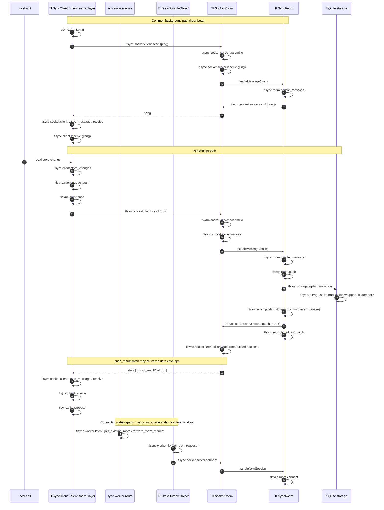

# Sync change path span map (client → server)

This document maps the sync span flow for a document change from browser client to server persistence/fanout.

## Sequence diagram (updated)

## Notes

- `traceparent` / `tracestate` are propagated in protocol `trace` carriers.
- Server ingress passes active context into room handling (`tlsync.socket.server.receive` → `tlsync.room.handle_message`).
- Push outcomes expose `tldraw.push_result.action` (`commit`, `discard`, `rebase`, `none`) and `tldraw.push_result.broadcast`.
- `push_result` can be sent as a data payload, so client-side receive type may be `data` rather than `push_result`.
- In the current `data/traces.jsonl` capture, client and server spans did **not** share trace IDs (no cross-service trace joins observed in that window).
