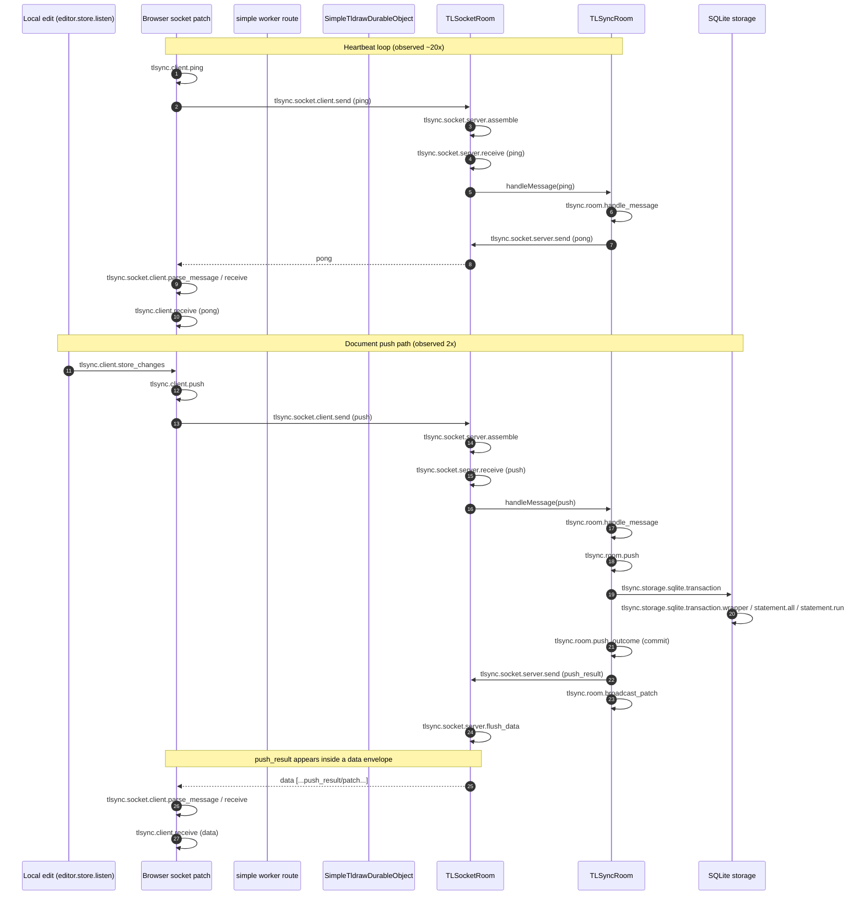

# Sync trace audit from `data/traces.jsonl`

This file reconstructs the **actual** code paths represented in `internal/observability/otel/data/traces.jsonl` and proposes sequence-diagram updates.

## Trace snapshot (what was captured)

- 28 JSONL entries
- 241 spans
- Services:
  - `tldraw-sync-core-simple-client` (121)
  - `tldraw-sync-worker-simple` (120)
- Dominant flows:
  - 20x heartbeat ping/pong
  - 2x document push
- No trace IDs span both services in this capture window.

## Reconstructed code paths (from spans → source)

### 1) Browser-side instrumentation (simple demo page script)

The captured client spans are produced by the inline script in:

- `apps/dotcom/sync-worker/src/simple/worker.ts`

Specifically:

- `tlsync.client.store_changes` from `instrumentEditor(...).store.listen(...)`
- `tlsync.client.push` + `tlsync.socket.client.send` from patched `WebSocket.send(...)`
- `tlsync.socket.client.parse_message`, `tlsync.socket.client.receive`, `tlsync.client.receive` from patched `message` listener
- `tlsync.socket.client.onerror` / `tlsync.socket.client.onclose` from socket event listeners

### 2) Server ingress and message handling

From sync-core runtime in the DO:

- `packages/sync-core/src/lib/TLSocketRoom.ts`
  - `tlsync.socket.server.assemble`
  - `tlsync.socket.server.receive`
  - forwards into `this.room.handleMessage(...)`

- `packages/sync-core/src/lib/TLSyncRoom.ts`
  - `tlsync.room.handle_message`
  - for push: `tlsync.room.push`
  - then `tlsync.room.push_outcome`

### 3) Storage transaction path

- `packages/sync-core/src/lib/SQLiteSyncStorage.ts`
  - `tlsync.storage.sqlite.transaction`

- `packages/sync-core/src/lib/DurableObjectSqliteSyncWrapper.ts`
  - `tlsync.storage.sqlite.transaction.wrapper`
  - `tlsync.storage.sqlite.statement.all`
  - `tlsync.storage.sqlite.statement.run`

### 4) Outbound response path

- `packages/sync-core/src/lib/TLSyncRoom.ts`
  - `tlsync.socket.server.send`
  - `tlsync.room.broadcast_patch`
  - `tlsync.socket.server.flush_data`

Important nuance from code and spans:

- `push_result` is treated as a **data message** for batching in `_unsafe_sendMessage`.
- So server send span has `tldraw.msg.type = push_result`, but client receives envelope type `data`.

## Observed sequence (steady-state + push)

## Suggested updates to `SYNC_CHANGE_SEQUENCE.md`

1. Add an **"Observed in simple demo traces"** variant (or note), because this capture is from the simple demo client instrumentation path.
2. Mark connection/setup spans as **optional in a given capture window** (`tlsync.client.connect`, `tlsync.worker.*`, `tlsync.worker.do.*`, `tlsync.socket.server.connect`, `tlsync.room.connect`).
3. Add explicit note: **`push_result` may be delivered inside `data` envelope**, so client receive type may be `data`.
4. Add heartbeat side-path (`ping`/`pong`) as a common dominant background flow.
5. Note that in this capture, **client and server spans do not share trace IDs**; treat cross-service trace continuity as expected only when both sides propagate and preserve the same carrier format in the active build.

