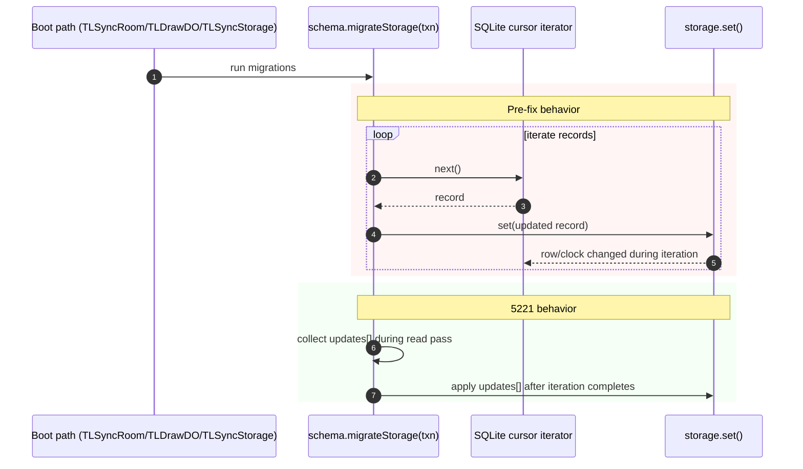

# Sync persistence investigation — 5221da51b

- **Checked-out ref:** `5221da51b` (validated from diff snapshot metadata: `_git_data/repos/tldraw-22691012/2026-02-27/2226/MAP.txt`, `SNAPSHOT_COMPARE: 5221da51b^..5221da51b`)
- **Compare ref:** `d6ff76672`
- **Prompt:** `investigation/prompts/sync-persistence-investigation-5221da51b.md`

## Scope and framing
This checkpoint fixes a migration-integrity bug: migrations could be applied more than once when iterating SQLite-backed storage and mutating it in the same loop.

## End-to-end migration/persistence path touched by this bug
1. `TLSyncRoom` constructor runs `this.schema.migrateStorage(txn)` during room boot (`packages/sync-core/src/lib/TLSyncRoom.ts:263-271`, `TLSyncRoom.constructor`).
2. Snapshot load path also runs migration in `loadSnapshotIntoStorage` (`packages/sync-core/src/lib/TLSyncStorage.ts:179-199`, `loadSnapshotIntoStorage`).
3. Worker storage boot in `TLDrawDurableObject.getStorage` runs `createTLSchema().migrateStorage(txn)` (`apps/dotcom/sync-worker/src/TLDrawDurableObject.ts:111-134`, `getStorage`).

So this bug affected core startup/load migration execution, not a narrow edge path.

## Root cause: double-application under live SQLite iteration
1. Pre-fix record-scope migration logic in `StoreSchema.migrateStorage` performed `storage.set(...)` inside `for (const [id, record] of storage.entries())` (shown in 5221 patch hunk `packages/store/src/lib/StoreSchema.ts`, `@@ -592,15 +592,22 @@` in `_git_data/.../2226/diff/all.patch`).
2. SQLite transaction iterators are live cursor-based:
   - `entries()` uses `iterateDocumentEntries.iterate()` (`packages/sync-core/src/lib/SQLiteSyncStorage.ts:561-568`, `SQLiteSyncStorageTransaction.entries`)
   - `values()` uses `iterateDocumentValues.iterate()` (`packages/sync-core/src/lib/SQLiteSyncStorage.ts:577-583`, `SQLiteSyncStorageTransaction.values`)
   - wrapper returns `sql.exec(...)[Symbol.iterator]()` directly (`packages/sync-core/src/lib/DurableObjectSqliteSyncWrapper.ts:24-28`, `DurableObjectStatement.iterate`)
3. `SQLiteSyncStorageTransaction.set()` mutates rows and advances clocks (`packages/sync-core/src/lib/SQLiteSyncStorage.ts:526-548`, `set`), so in-loop writes can perturb traversal and revisit rows.
4. The new regression test calls this out explicitly and asserts once-per-record migration (`packages/sync-core/src/test/SQLiteSyncStorage.test.ts:1382-1436`, `describe('Schema migrations via migrateStorage')`).

## Fix: deferred / batched writes
### A) Core migration engine fix
`StoreSchema.migrateStorage` now stages updates during iteration and applies them after loop completion:
- `const updates: [string, R][] = []`
- collect changed records
- apply with a second `for (const [id, record] of updates) storage.set(id, record)`

Evidence: patch hunk in `_git_data/.../2226/diff/all.patch` and resulting code path in `packages/store/src/lib/StoreSchema.ts` (`migrateStorage`).

### B) Arrow storage migration fix
`TLArrowShape` `ExtractBindings` storage migration similarly switched from in-loop `storage.set` to batched deferred application (`packages/tlschema/src/shapes/TLArrowShape.ts:363-421`, `arrowShapeMigrations` / `ExtractBindings.up`; plus patch hunks in `_git_data/.../2226/diff/all.patch`).

## Ack / rebroadcast semantics
Unchanged at this checkpoint. Changed files for 5221 are migration engine + shape migration + tests (`_git_data/.../2226/MAP.txt`, changed file tree). No protocol or push/rebase path edits were introduced.

## Failure/retry/consistency analysis
- **Improved:** migration consistency under SQLite-backed iteration; avoids duplicate application side effects.
- **Unchanged:** runtime startup fallback/retry behavior from previous checkpoint (`d6ff76672`) remains separate.
- **Residual risk:** migration authors can still reintroduce this class of bug if they mutate storage while iterating without the staged-update pattern.

## Evolution vs d6ff76672
- `d6ff76672` focused on startup resilience in sync worker (`TLFileDurableObject` SQLite load fallback, `ROOM_NOT_FOUND` handling, retry hardening).
- `5221da51b` focuses on migration correctness in schema/storage layer (`StoreSchema`, `TLArrowShape`, migration tests).
- Architectural shift at 5221: enforce read-then-write migration pattern so live cursor iteration cannot be invalidated by writes.
- Durability semantics changed at 5221 in terms of **migration correctness**, not room boot source-selection/recovery policy.

## Eliminated hypotheses
1. **“This is an ack/rebroadcast protocol bug.”** Eliminated: no protocol-path files changed in 5221 (`_git_data/.../2226/MAP.txt`).
2. **“Only arrow migration was buggy.”** Eliminated: core generic migration engine was fixed in `StoreSchema.migrateStorage`.
3. **“Double apply only occurs because migration is called from multiple places.”** Eliminated by dedicated regression tests that assert once-per-record behavior for a single migration invocation.

## Recommendations
1. Enforce migration author rule: do not mutate storage while iterating storage cursors.
2. Add/keep backend-parity regression tests (in-memory and SQLite) for once-per-record migration semantics.
3. Consider helper APIs in migration framework for “collect updates then apply” to reduce footguns.
4. Document live-cursor caveat in migration authoring docs.

## Mermaid sequence diagram

