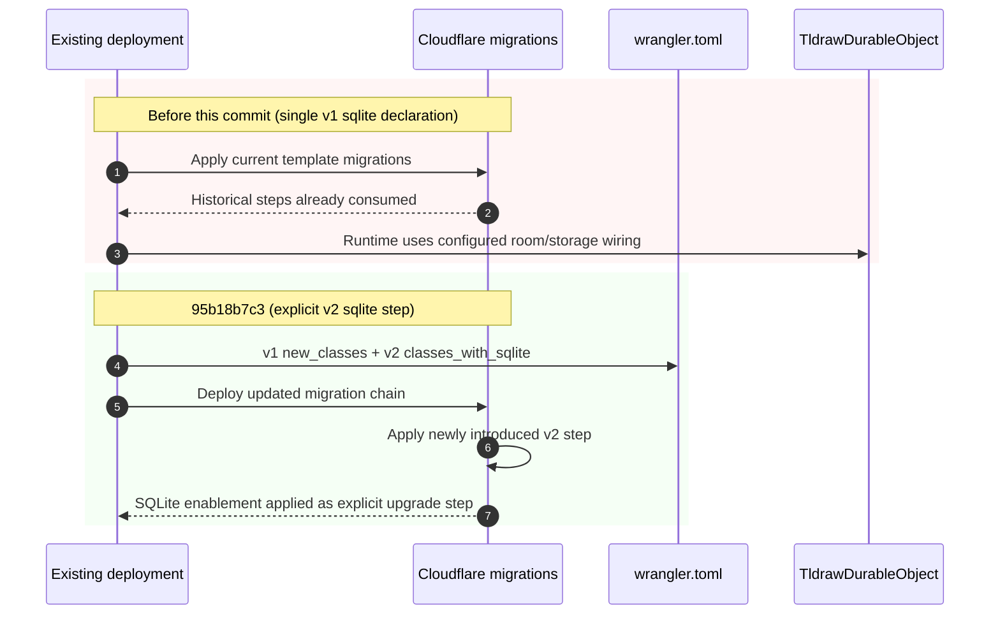

# Sync persistence investigation — 95b18b7c3

- **Checked-out ref:** `95b18b7c3` (artifact-validated via `_git_data/repos/tldraw-22691012/2026-02-27/2235/MAP.txt:10`, `SNAPSHOT_COMPARE: 95b18b7c3^..95b18b7c3`)
- **Compare ref:** `5221da51b` (artifact-validated via `_git_data/repos/tldraw-22691012/2026-02-27/2236/MAP.txt:10`)
- **Prompt:** `investigation/prompts/sync-persistence-investigation-95b18b7c3.md`

## Scope and framing
This checkpoint is a deployment-migration sequencing fix for the Cloudflare template Durable Object config. It does not modify sync protocol handlers; it modifies migration declarations that govern when SQLite mode is enabled.

## End-to-end persistence path context (where this commit acts)
1. Worker routes connect requests to the Durable Object binding in `router.get('/api/connect/:roomId', ...)` (`templates/sync-cloudflare/worker/worker.ts:17-21`).
2. Durable Object receives the request through `fetch()` and `handleConnect()` (`templates/sync-cloudflare/worker/TldrawDurableObject.ts:40-56`).
3. Persistence backend is initialized in `TldrawDurableObject.constructor` via `DurableObjectSqliteSyncWrapper(ctx.storage)` and `SQLiteSyncStorage` (`templates/sync-cloudflare/worker/TldrawDurableObject.ts:24-32`).
4. This commit changes the migration control plane in `templates/sync-cloudflare/wrangler.toml` (hunk `@@ -24,10 +24,13 @@` in `_git_data/repos/tldraw-22691012/2026-02-27/2235/diff/all.patch:6`; also `_git_data/repos/tldraw-22691012/2026-02-27/2235/deep/hunks.jsonl:1`).

## Root cause-style explanation
### Direct evidence
- Commit delta changes only one file: `templates/sync-cloudflare/wrangler.toml` (`_git_data/repos/tldraw-22691012/2026-02-27/2235/MAP.txt:12,69-72`).
- Removed at v1: comment and `new_sqlite_classes = ["TldrawDurableObject"]` (`_git_data/repos/tldraw-22691012/2026-02-27/2235/deep/changed_lines.tsv:1-2`).
- Added: `new_classes = ["TldrawDurableObject"]` under `tag = "v1"`, then a new `tag = "v2"` with `classes_with_sqlite = ["TldrawDurableObject"]` (`_git_data/repos/tldraw-22691012/2026-02-27/2235/deep/changed_lines.tsv:3-7`).

### Why this matters
- The migration history is append-only in production config guidance (`apps/dotcom/sync-worker/wrangler.toml:10-12`).
- This commit makes SQLite enablement an explicit new migration step (`v2`) rather than only encoding it in the initial creation migration.
- **Inference (from config pattern + commit diff):** this reduces upgrade-path risk for already-live deployments where historical tags are already applied.

## Ack / rebroadcast semantics
Unchanged in this checkpoint.
- No protocol/runtime code files changed in the target delta; only template `wrangler.toml` changed (`_git_data/repos/tldraw-22691012/2026-02-27/2235/MAP.txt:69-76`).
- Therefore socket ack/rebroadcast logic is unaffected by this commit; the change is migration sequencing and storage-mode activation timing.

## Failure / retry / consistency mechanisms
- **Improved consistency at deploy-time:** SQLite enablement is represented as an explicit subsequent migration step.
- **Failure mode addressed:** relying on a single initial migration declaration for SQLite class setup can miss intended upgrade behavior in existing environments.
- **Unchanged runtime retry behavior:** no changes in room/socket/persistence runtime code paths at this checkpoint.

## Evolution vs 5221da51b
- `5221da51b` addressed data-plane migration correctness (preventing double-apply during storage iteration) in schema/storage code.
- `95b18b7c3` addresses control-plane migration sequencing in Cloudflare template configuration.
- Direct compare evidence for this evolution is the same wrangler hunk in `_git_data/repos/tldraw-22691012/2026-02-27/2236/diff/all.patch:1-20` and compare metadata in `_git_data/repos/tldraw-22691012/2026-02-27/2236/MAP.txt:10`.

## Eliminated hypotheses
1. **“This is an ack/rebroadcast bug.”** Eliminated: only template migration TOML changed.
2. **“`TldrawDurableObject` runtime logic changed.”** Eliminated: no `.ts` runtime files are in the changed-file tree.
3. **“Routing to DO changed.”** Eliminated: no changes in `worker.ts` route wiring.
4. **“This is the same bug class as 5221.”** Eliminated: 5221 is storage migration execution integrity; 95b18 is deployment migration sequencing.

## Recommendations / preventive measures
1. Keep template migration tags append-only; never repurpose already-shipped tags.
2. Keep class creation and SQLite-enable transitions as explicit separate migration steps.
3. Add an append-only warning comment to `templates/sync-cloudflare/wrangler.toml` mirroring production guidance.
4. Add a short template README note documenting upgrade-safe DO SQLite migration sequencing.

## Mermaid sequence diagram

