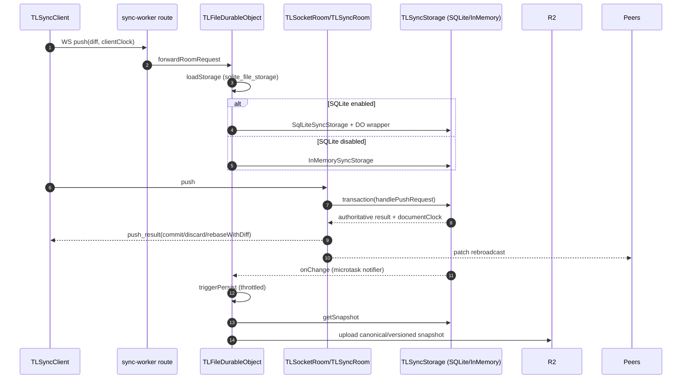

# Sync persistence investigation — 967d3af52

- **Checked-out ref:** `967d3af52` (detached HEAD)
- **Compare ref:** `d039f3a1a`
- **Mode:** delta from `investigation/findings/sync-persistence-investigation-d039f3a1a.md`

## Scope and framing
This checkpoint keeps `TLSyncRoom` as the authoritative sync protocol engine, but introduces a concrete SQLite-backed `TLSyncStorage` implementation plus Cloudflare DO / Node wrappers, and routes dotcom room DO traffic through `TLFileDurableObject` with feature-flagged SQLite boot.

## End-to-end persistence flow at this checkpoint

### 1) Client mutation transport and room ingress
- Room websocket requests are forwarded through `forwardRoomRequest` (`apps/dotcom/sync-worker/src/routes/tla/forwardRoomRequest.ts:8-17`) from `/app/file/:roomId` worker route (`apps/dotcom/sync-worker/src/worker.ts:117-120`).
- `TLDR_DOC` is bound to `TLFileDurableObject` (`apps/dotcom/sync-worker/src/types.ts:22`, `apps/dotcom/sync-worker/src/utils/durableObjects.ts:23-27`, `apps/dotcom/sync-worker/wrangler.toml:95-139`).

### 2) Storage initialization and room boot sequence (SQLite emphasis)
- `TLFileDurableObject.loadStorage` gates backend choice via `sqlite_file_storage` (`apps/dotcom/sync-worker/src/TLFileDurableObject.ts:15-33`).
  - If disabled: legacy in-memory load path (`super.loadStorage`).
  - If enabled: `DurableObjectSqliteSyncWrapper` + `SqlLiteSyncStorage`.
- Cold-start SQLite path uses `SqlLiteSyncStorage.hasBeenInitialized(sql)` to decide whether to hydrate from prior snapshot (`apps/dotcom/sync-worker/src/TLFileDurableObject.ts:25-33`, `packages/sync-core/src/lib/SqlLiteSyncStorage.ts:180-195`).
- `TLDrawDurableObject.getStorage` wraps load in retry, registers `storage.onChange(() => triggerPersist())`, then runs schema storage migration (`apps/dotcom/sync-worker/src/TLDrawDurableObject.ts:111-134`).
- `getRoom` injects storage into `TLSocketRoom` and keeps lifecycle hooks (`apps/dotcom/sync-worker/src/TLDrawDurableObject.ts:142-199`; `packages/sync-core/src/lib/TLSocketRoom.ts:178-228`).

### 3) Backend ingest + authoritative apply → SQLite writes
- `TLSyncRoom.handlePushRequest` remains authoritative and performs apply inside `storage.transaction(..., { id: internalTxnId, emitChanges: 'when-different' })` (`packages/sync-core/src/lib/TLSyncRoom.ts:860-1152`).
- SQLite transaction boundary is synchronous/atomic and rejects async callbacks (`packages/sync-core/src/lib/SqlLiteSyncStorage.ts:332-367`).
- Durable writes happen through `SqlLiteSyncStorageTransaction` (`set`, `delete`) over SQLite tables (`packages/sync-core/src/lib/SqlLiteSyncStorage.ts:470-572`).
- Core storage contract unchanged: `transaction`, `onChange`, `getSnapshot` (`packages/sync-core/src/lib/TLSyncStorage.ts:77-92`).

### 4) Ack / rebroadcast semantics
- `push_result` semantics remain `commit` / `discard` / `rebaseWithDiff` from authoritative apply output (`packages/sync-core/src/lib/TLSyncRoom.ts:1089-1135` in `handlePushRequest`).
- Peer rebroadcast remains patch-based (`packages/sync-core/src/lib/TLSyncRoom.ts:1141-1152`; `broadcastPatch` at `:376-433`).
- External storage writes are rebroadcast by constructor `onChange` wiring and internal transaction-id filtering (`packages/sync-core/src/lib/TLSyncRoom.ts:229-296`, `broadcastExternalStorageChanges`).

### 5) Persistence scheduling, notifier behavior, durable snapshot writes
- Storage change notification uses `MicrotaskNotifier` semantics (queued microtask notify) (`packages/sync-core/src/lib/MicrotaskNotifier.ts:8-35`; used in `packages/sync-core/src/lib/SqlLiteSyncStorage.ts:332-367` and `packages/sync-core/src/lib/InMemorySyncStorage.ts:130-223`).
- In DO runtime, `onChange` triggers throttled persistence (`apps/dotcom/sync-worker/src/TLDrawDurableObject.ts:120-126`, `:594-596`).
- Throttle is leading + trailing (`apps/dotcom/sync-worker/src/utils/throttle.ts:1-16`) with `PERSIST_INTERVAL_MS = 8000` (`apps/dotcom/sync-worker/src/config.ts:1`).
- Durable write path (`persistToDatabase`) uses queueing, retry, health signals, and `_lastPersistedClock` / `_isRestoring` guards (`apps/dotcom/sync-worker/src/TLDrawDurableObject.ts:913-974`).
- Last-session lifecycle explicitly persists before room close (`apps/dotcom/sync-worker/src/TLDrawDurableObject.ts:142-199`, `onSessionRemoved`).
- Restore path writes via `loadSnapshotIntoStorage` transaction boundary (`apps/dotcom/sync-worker/src/TLDrawDurableObject.ts:346-395`; `packages/sync-core/src/lib/TLSyncStorage.ts:167-199`).

## SQLite backend implementation details
- Schema bootstrap/migration for `documents`, `tombstones`, `metadata` and indexes (`packages/sync-core/src/lib/SqlLiteSyncStorage.ts:85-176`).
- Initialization check (`hasBeenInitialized`) against metadata row (`packages/sync-core/src/lib/SqlLiteSyncStorage.ts:180-195`).
- Constructor prepares SQL statements and loads initial snapshot state (`packages/sync-core/src/lib/SqlLiteSyncStorage.ts:197-327`).
- Tombstone pruning scheduling and cutoff semantics (`packages/sync-core/src/lib/SqlLiteSyncStorage.ts:390-414`; `getChangesSince` behavior at `:551-572`).
- Snapshot serialization for persistence/export boundary (`packages/sync-core/src/lib/SqlLiteSyncStorage.ts:415-438`).
- Cloudflare wrapper transaction boundary (`packages/sync-core/src/lib/DurableObjectSqliteSyncWrapper.ts:74-92`), Node wrapper transaction boundary (`packages/sync-core/src/lib/NodeSqliteWrapper.ts:71-96`).

## Evolution vs d039f3a1a
1. **New concrete backend:** `TLSyncStorage` contract now has a first production SQLite implementation (`SqlLiteSyncStorage`) plus platform wrappers.
2. **DO class and migration rollout:** `TLDR_DOC` binding is moved to `TLFileDurableObject`, with wrangler SQLite migration and feature-flag rollout controls (`apps/dotcom/sync-worker/wrangler.toml:45-47`, `:95-139`; `apps/dotcom/sync-worker/src/adminRoutes.ts:374-403`).
3. **Authoritative sync semantics unchanged:** `TLSyncRoom` still decides commit/discard/rebase and peer rebroadcast.
4. **Durability topology still hybrid:** live authoritative state can now be SQLite, while durable snapshots/history continue through DO persistence to R2.
5. **In-memory parity refactor:** in-memory storage now also uses `MicrotaskNotifier` and shared tombstone-pruning behavior, aligning semantics with SQLite-style notification/tombstone handling (`packages/sync-core/src/lib/InMemorySyncStorage.ts:130-223`, `:228-260`, `:289-387`; `packages/sync-core/src/lib/computeTombstonePruning.test.ts`).

## Failure / retry / consistency mechanisms
- Boot retry wrapper around storage loading (`apps/dotcom/sync-worker/src/TLDrawDurableObject.ts:111-118`).
- Feature-flagged dual-backend mode (SQLite vs in-memory) as explicit migration safety boundary (`apps/dotcom/sync-worker/src/TLFileDurableObject.ts:15-33`; defaults in `apps/dotcom/sync-worker/src/utils/featureFlags.ts:18-27`).
- Atomic storage transaction boundaries in wrappers/backend (`packages/sync-core/src/lib/DurableObjectSqliteSyncWrapper.ts:74-92`, `packages/sync-core/src/lib/NodeSqliteWrapper.ts:71-96`, `packages/sync-core/src/lib/SqlLiteSyncStorage.ts:332-367`).
- Persist retry + health signaling + dedupe guards (`apps/dotcom/sync-worker/src/TLDrawDurableObject.ts:919-955`, `:932-943`).
- Deletion cleanup path closes sessions, clears room and DO storage, and removes persisted artifacts (`apps/dotcom/sync-worker/src/TLDrawDurableObject.ts:1149-1246`).

## Eliminated hypotheses
- **Hypothesis:** checkpoint rewrites sync ack protocol. **Eliminated:** `commit/discard/rebaseWithDiff` path is unchanged in `TLSyncRoom.handlePushRequest`.
- **Hypothesis:** SQLite rollout is immediate and global. **Eliminated:** runtime gate via `sqlite_file_storage` keeps dual backend paths.
- **Hypothesis:** SQLite replaces snapshot durability path. **Eliminated:** DO still persists canonical/version snapshots to R2 via existing `persistToDatabase` flow.

## Recommendations and preventive measures
1. Add explicit regression tests for mixed-backend rollout scenarios (flag flip, cold-start seeding, and parity in `push_result` semantics).
2. Add end-to-end tests for microtask-based notification ordering across SQLite/in-memory backends to prevent subtle rebroadcast regressions.
3. Track tombstone-pruning thresholds and `wipeAll` incidence operationally; alert when clients repeatedly reconnect due to pruned history windows.
4. Document operational expectations for hybrid durability (SQLite live state + R2 snapshots) to reduce false assumptions in incident response.

## Mermaid sequence diagram

