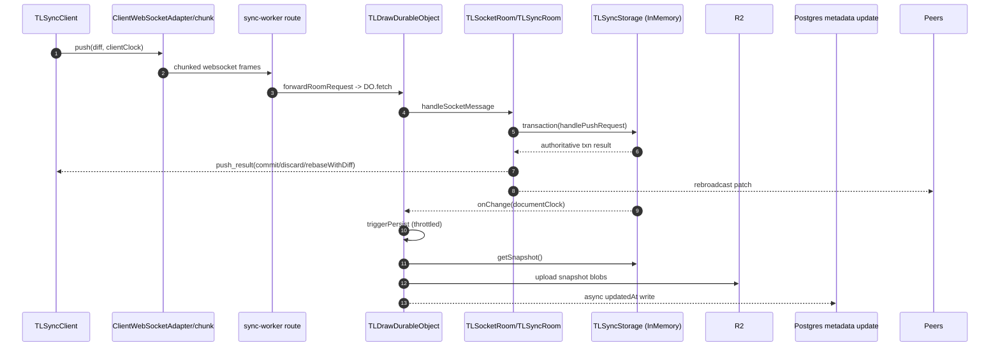

# Sync persistence investigation — d039f3a1a

- **Checked-out ref:** `d039f3a1a` (detached HEAD)
- **Compare ref:** `016d4c288`
- **Mode:** delta from `investigation/findings/sync-persistence-investigation-v3.15.x.md`

## Scope and framing
This checkpoint is the storage-architecture pivot: persistence responsibilities move from room-owned inline state/callbacks to a pluggable `TLSyncStorage` contract used by `TLSyncRoom` and Durable Object runtimes.

## End-to-end persistence flow at this checkpoint

### 1) Client mutation, diff emission, transport
- `TLSyncClient` subscribes to store updates and queues push requests (`packages/sync-core/src/lib/TLSyncClient.ts:201-211`, `flushPendingPushRequests` at `:501-575`).
- Outbound protocol messages are sent through websocket adapter/chunking (`packages/sync-core/src/lib/ClientWebSocketAdapter.ts:198-207`, `packages/sync-core/src/lib/chunk.ts:12-30`, `:42-79`).
- Dotcom sync worker forwards websocket room traffic to the room Durable Object (`apps/dotcom/sync-worker/src/worker.ts:107-114`, `apps/dotcom/sync-worker/src/routes/tla/forwardRoomRequest.ts:7-15`).

### 2) Backend ingest and authoritative apply
- `TLSocketRoom` constructor now accepts `storage` as first-class input; `initialSnapshot` and `onDataChange` are deprecated compatibility options (`packages/sync-core/src/lib/TLSocketRoom.ts:171-210`).
- `TLSyncRoom` constructor migrates and uses storage transaction APIs (`packages/sync-core/src/lib/TLSyncRoom.ts:205-291`, `schema.migrateStorage(...)`).
- Authoritative merge happens in `handlePushRequest` inside `storage.transaction(..., { emitChanges: 'when-different' })` (`packages/sync-core/src/lib/TLSyncRoom.ts:851-1170`).
- Storage transaction contract and change emission are defined by `TLSyncStorage` (`packages/sync-core/src/lib/TLSyncStorage.ts:79-92`, `:107-131`) and implemented for default in-memory storage (`packages/sync-core/src/lib/InMemorySyncStorage.ts:146-204`).

### 3) Ack/rebroadcast semantics
- Server returns `push_result` with authoritative outcomes (`commit`, `discard`, `rebaseWithDiff`) from `handlePushRequest` based on diff validity and rebasing results (`packages/sync-core/src/lib/TLSyncRoom.ts:851-1170`).
- Rebroadcast for other sessions is driven by applied change visibility (`packages/sync-core/src/lib/TLSyncRoom.ts`, same function + `broadcastExternalStorageChanges` at `:292-296`).

### 4) Persistence scheduling and durable writes
- Persistence trigger origin moved to storage lifecycle: DO creates storage with `onChange: this.triggerPersist` (`apps/dotcom/sync-worker/src/TLDrawDurableObject.ts:96-131`).
- Room creation injects storage into `TLSocketRoom` (`apps/dotcom/sync-worker/src/TLDrawDurableObject.ts:137-199`).
- Persist path reads authoritative snapshot from storage (`persistToDatabase`, `storage.getSnapshot`) and writes to R2 with clock-based dedupe (`apps/dotcom/sync-worker/src/TLDrawDurableObject.ts:760-834`, `:836-850`; `apps/dotcom/sync-worker/src/config.ts:1-5`; `apps/dotcom/sync-worker/src/utils/throttle.ts:1-16`).

### 5) Snapshot load/restore and consistency
- Restore/load path writes into storage using `loadSnapshotIntoStorage` (`apps/dotcom/sync-worker/src/TLDrawDurableObject.ts:365-415`, `packages/sync-core/src/lib/TLSyncStorage.ts:167-185`).
- Snapshot conversion helper remains available for store snapshots (`packages/sync-core/src/lib/TLSyncStorage.ts:187-199`).
- In-memory storage snapshot getter used for persistence serialization (`packages/sync-core/src/lib/InMemorySyncStorage.ts:241-249`).

## Migration semantics change (`store` vs `storage` scope)
- Migration model adds `scope: 'storage'` (`packages/store/src/lib/migrate.ts:190-218`).
- Storage migration interface allows schema-aware whole-storage transforms (`packages/store/src/lib/migrate.ts:231-236`).
- `StoreSchema.migrateStorage` executes record/store/storage migration pipeline (`packages/store/src/lib/StoreSchema.ts:560-636`).
- Compatibility gate in connect rejects clients when required migrations are not record/down-compatible (`packages/sync-core/src/lib/TLSyncRoom.ts:772-790`; related persisted-record handling `packages/store/src/lib/StoreSchema.ts:496-522`).
- Built-in schema migrations now use storage semantics where needed (`packages/tlschema/src/store-migrations.ts:44-88`; arrow extraction migration `packages/tlschema/src/shapes/TLArrowShape.ts:302-379`).

## Evolution vs 016d4c288
1. **State ownership moved** from room-centric inline state to pluggable `TLSyncStorage` transactions.
2. **Persistence trigger moved** from room callback-centric wiring to `storage.onChange` lifecycle.
3. **Snapshot boundary moved** to storage-first (`loadSnapshotIntoStorage`, `storage.getSnapshot`).
4. **Migration capability expanded** with `scope: 'storage'` for whole-storage transformations.
5. **Client compatibility handling tightened** for non-record/downless migration requirements.

## Failure/retry/consistency mechanisms
- Throttled persistence scheduling (`PERSIST_INTERVAL_MS`) reduces write amplification and coalesces rapid mutation bursts (`apps/dotcom/sync-worker/src/config.ts:1-5`, `utils/throttle.ts:1-16`).
- Clock guard (`_lastPersistedClock`) prevents redundant durable writes (`TLDrawDurableObject.ts:760-834`).
- Transactional apply in storage boundary ensures authoritative responses derive from committed transaction state (`TLSyncRoom.ts:851-1170`, `InMemorySyncStorage.ts:146-204`).
- Ack response semantics (`commit/discard/rebaseWithDiff`) provide deterministic client convergence behavior (`TLSyncRoom.ts:851-1170`).

## Eliminated hypotheses
- **Hypothesis:** ingress transport changed at this checkpoint. **Eliminated:** websocket/chunk forwarding remains structurally similar; primary delta is server storage boundary.
- **Hypothesis:** persistence still originates from room-owned `onDataChange`. **Eliminated:** DO persistence scheduling is wired to `storage.onChange`.
- **Hypothesis:** migrations still operate only at record/store level. **Eliminated:** `scope: 'storage'` is introduced and exercised by built-in migrations.

## Recommendations and preventive measures
1. Keep storage implementations transactional and explicit about `emitChanges` behavior to preserve rebroadcast correctness.
2. Treat migration-scope changes as sync protocol compatibility events; enforce client version gating tests around connect handshake.
3. Add regression tests for `onChange`-driven persistence scheduling and clock-dedupe behavior to protect durability semantics.
4. Document backend expectations for storage implementations (snapshot fidelity, tombstone handling, clock monotonicity) before introducing alternative backends.

## Mermaid sequence diagram

