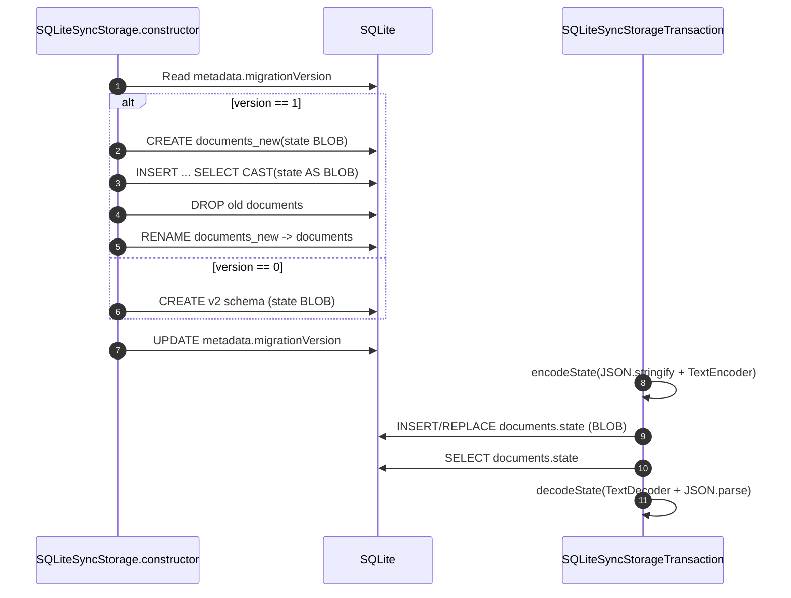

# Sync persistence investigation — d1c72b2b0

- **Checked-out ref:** `d1c72b2b0` (detached HEAD)
- **Compare ref:** `967d3af52`
- **Mode:** delta from `investigation/findings/sync-persistence-investigation-967d3af52.md`

## Scope and framing
This checkpoint is a persistence-representation migration: SQLite `documents.state` changes from JSON `TEXT` to UTF-8 `BLOB` bytes, with explicit v1→v2 migration handling.

## Persistence flow at this checkpoint

### 1) Storage contract and transaction boundary (unchanged)
- `TLSyncStorage` contract still centers on synchronous `transaction`, `getClock`, `onChange`, and optional `getSnapshot` (`packages/sync-core/src/lib/TLSyncStorage.ts:77-89`, `TLSyncStorage`).
- Snapshot loading still goes through `loadSnapshotIntoStorage`, then `schema.migrateStorage(txn)` (`packages/sync-core/src/lib/TLSyncStorage.ts:179-198`, `loadSnapshotIntoStorage`).
- SQLite transaction wrapper remains atomic in both runtimes (`packages/sync-core/src/lib/NodeSqliteWrapper.ts:86-98`, `NodeSqliteWrapper.transaction`; `packages/sync-core/src/lib/DurableObjectSqliteSyncWrapper.ts:89-91`, `DurableObjectSqliteSyncWrapper.transaction`).

### 2) Migration execution order and guards (v1 → v2)
- `migrateSqliteSyncStorage` reads `metadata.migrationVersion`; if unavailable, defaults to `0` (`packages/sync-core/src/lib/SQLiteSyncStorage.ts:85-102`, `migrateSqliteSyncStorage`).
- Fresh init (`version 0`) now creates `documents.state BLOB` directly and inserts metadata with `migrationVersion = 2` (`packages/sync-core/src/lib/SQLiteSyncStorage.ts:104-133`).
- Upgrade path (`version 1`) rebuilds the table and converts state with `CAST(state AS BLOB)` (`packages/sync-core/src/lib/SQLiteSyncStorage.ts:136-158`).
- Migration result is persisted by `UPDATE metadata SET migrationVersion = ${migrationVersion}` (`packages/sync-core/src/lib/SQLiteSyncStorage.ts:163`).

### 3) Pre/post migration encoding/decoding semantics
- Serialization boundary is now explicit:
  - `encodeState`: `JSON.stringify` → `TextEncoder.encode` (`packages/sync-core/src/lib/SQLiteSyncStorage.ts:167-169`, `encodeState`)
  - `decodeState`: `TextDecoder.decode` → `JSON.parse` (`packages/sync-core/src/lib/SQLiteSyncStorage.ts:171-173`, `decodeState`)
- Transactional reads/writes always cross that byte boundary (`packages/sync-core/src/lib/SQLiteSyncStorage.ts:534-553`, `SQLiteSyncStorageTransaction.get/set/delete`; `:595-621`, `getChangesSince`).

### 4) Compatibility evidence from tests
- Migration regression test bootstraps a legacy v1 schema (`state TEXT`, `migrationVersion = 1`), inserts JSON-string rows, then initializes new storage and verifies:
  - old records are readable,
  - tombstones and clocks survive,
  - post-migration writes work (`packages/sync-core/src/test/SQLiteSyncStorage.test.ts:1285-1364`, `describe('Migration from TEXT to BLOB')`).
- Fresh DB path asserts migration version is `2` (`packages/sync-core/src/test/SQLiteSyncStorage.test.ts:1367-1376`).

## Evolution vs 967d3af52
1. **Schema target changed**: 967 created `documents.state TEXT`; d1 creates/maintains `documents.state BLOB`.
   - 967 evidence: `git show 967d3af52:packages/sync-core/src/lib/SqlLiteSyncStorage.ts` lines 107-112 (`migrateSqliteSyncStorage`).
   - d1 evidence: `packages/sync-core/src/lib/SQLiteSyncStorage.ts:108-111`.
2. **Encoding boundary changed**: 967 parsed/stringified directly at SQL read/write sites; d1 introduces centralized `encodeState/decodeState` byte conversion.
   - 967 evidence: `SqlLiteSyncStorageTransaction.get/set/getChangesSince` (`git show ...` lines 479-483, 486-493, 540-563).
   - d1 evidence: `SQLiteSyncStorageTransaction.get/set/getChangesSince` (`packages/sync-core/src/lib/SQLiteSyncStorage.ts:534-562`, `:595-621`) plus helpers at `:167-173`.
3. **Upgrade safety improved**: d1 adds an explicit migration step and a targeted regression suite; 967 had no v1→v2 conversion path.

## Risk scenarios and upgrade-path safety
- **Large dataset migration overhead**: v1→v2 table rebuild temporarily duplicates document table contents (`CREATE ..._new`, copy, drop, rename), increasing I/O and transient storage pressure (`packages/sync-core/src/lib/SQLiteSyncStorage.ts:136-158`).
- **Large record memory spikes still possible**: conversion still materializes full JSON strings and byte arrays in process (`encodeState/decodeState`), so very large payloads can amplify allocations (`packages/sync-core/src/lib/SQLiteSyncStorage.ts:167-173`).
- **Encoding assumption**: migration uses `CAST(state AS BLOB)` and runtime decoding assumes UTF-8 JSON bytes. Safe for historical JSON text rows; malformed legacy payloads would fail decode/parse.
- **Safety signal**: regression test demonstrates successful in-place migration with preserved clocks/tombstones and continued writes (`packages/sync-core/src/test/SQLiteSyncStorage.test.ts:1285-1364`).

## Eliminated hypotheses
- **Hypothesis:** this checkpoint changes sync ack/rebroadcast semantics. **Eliminated:** changes are localized to SQLite representation/migration; storage transaction contract remains stable.
- **Hypothesis:** old TEXT databases need wipe-and-reseed. **Eliminated:** in-place v1→v2 migration is implemented and tested.

## Recommendations
1. Add migration telemetry (row count, duration, failure reason) around `migrateSqliteSyncStorage` for safer rollout monitoring.
2. Add stress tests with very large records across migration boundary to quantify memory/latency impact.
3. Document migration-time storage amplification expectations for operators.

## Mermaid sequence diagram

