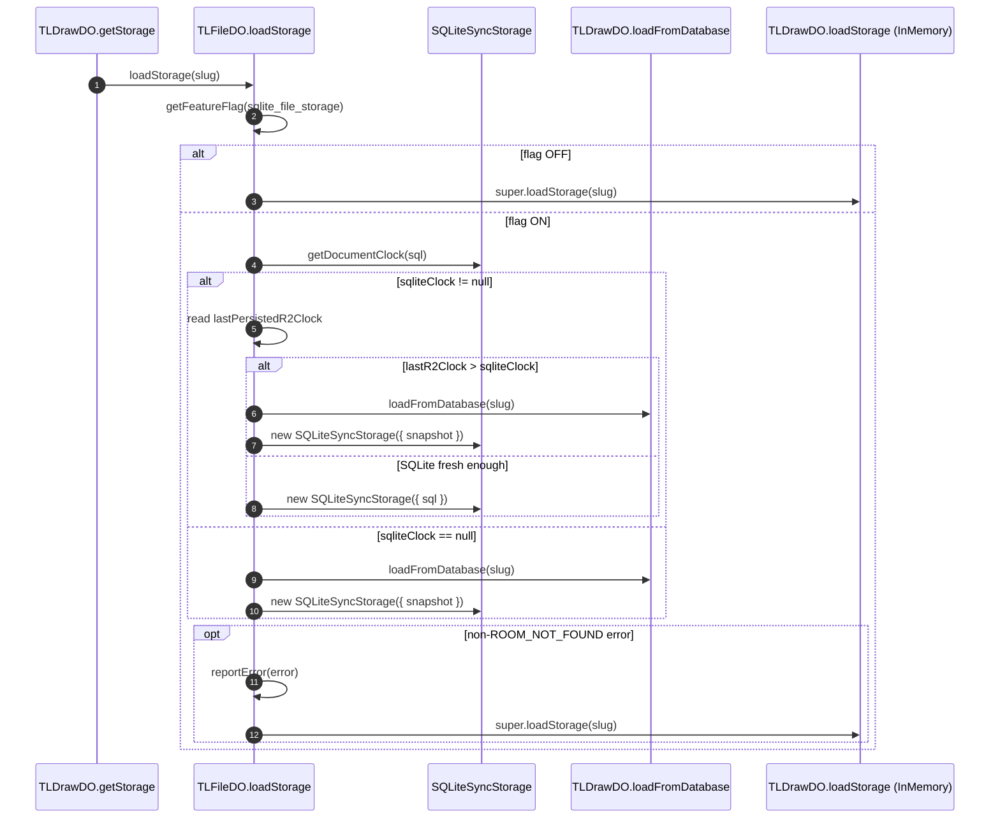

# Sync persistence investigation — d6ff76672

- **Checked-out ref:** `d6ff76672` (detached HEAD)
- **Compare ref:** `d1c72b2b0`
- **Prompt:** `investigation/prompts/sync-persistence-investigation-d6ff76672.md`

## Scope and framing
This checkpoint hardens Durable Object startup reliability for SQLite-backed file rooms. The core change is a guarded fallback from SQLite boot to base in-memory loading for non-`ROOM_NOT_FOUND` failures, while preserving not-found semantics and existing sync protocol behavior.

## End-to-end persistence and recovery behavior

### 1) Startup source selection in file DO
- `TLFileDurableObject.loadStorage` gates SQLite by feature flag `sqlite_file_storage` (`apps/dotcom/sync-worker/src/TLFileDurableObject.ts:12-17`, `loadStorage`; `apps/dotcom/sync-worker/src/utils/featureFlags.ts:18-21,52-56`, `getFeatureFlag`).
- If SQLite is enabled, it reads local SQLite freshness via `SQLiteSyncStorage.getDocumentClock(sql)` (`TLFileDurableObject.ts:20-21`, `loadStorage`; `packages/sync-core/src/lib/SQLiteSyncStorage.ts:232-246`, `getDocumentClock`).
- If SQLite is initialized (`sqliteClock !== null`), DO storage key `lastPersistedR2Clock` is compared to determine source of truth (`TLFileDurableObject.ts:26-38`, `loadStorage`).
- If `lastR2Clock > sqliteClock`, room snapshot is loaded from DB/R2 and used to reinitialize SQLite (`TLFileDurableObject.ts:29-35`, `loadStorage`).
- If SQLite is uninitialized (`sqliteClock === null`), DB/R2 snapshot is loaded and used to initialize SQLite (`TLFileDurableObject.ts:41-47`, `loadStorage`).

### 2) SQLite load fallback behavior (new at this checkpoint)
- Entire SQLite load path is wrapped in `try/catch` (`TLFileDurableObject.ts:19-55`, `loadStorage`).
- If caught error is `ROOM_NOT_FOUND`, it is rethrown (`TLFileDurableObject.ts:49-51`).
- Otherwise, error is reported via `this.reportError(error)` and fallback to `super.loadStorage(slug)` is used (`TLFileDurableObject.ts:53-54`).
- Base `super.loadStorage` path in `TLDrawDurableObject` loads snapshot via `loadFromDatabase` and returns `InMemorySyncStorage` (`apps/dotcom/sync-worker/src/TLDrawDurableObject.ts:95-102`, `loadStorage`).

### 3) Database/R2 loading path used by both primary and fallback flows
- `loadFromDatabase` source order: R2 room object first; then create-source flow; then app-file existence check for default-initial snapshot; then Supabase legacy path (`TLDrawDurableObject.ts:705-781`, `loadFromDatabase`).
- If no room exists, `ROOM_NOT_FOUND` is thrown from multiple branches (`TLDrawDurableObject.ts:741,752,774`, `loadFromDatabase`).

### 4) Persistence checkpoint used for reconciliation
- On persist success, snapshot is uploaded, `_lastPersistedClock` is updated, and `ctx.storage.put('lastPersistedR2Clock', snapshot.documentClock)` records R2 freshness for later boot arbitration (`TLDrawDurableObject.ts:939-946`, `persistToDatabase`).

### 5) Retry and not-found semantics
- Storage init retry excludes `ROOM_NOT_FOUND`: `matchError: (error) => error !== ROOM_NOT_FOUND` (`TLDrawDurableObject.ts:114-119`, `getStorage`).
- Websocket request path maps `ROOM_NOT_FOUND` to NOT_FOUND close reason (`TLDrawDurableObject.ts:586-589`, `onRequest`).

### 6) Ack / rebroadcast semantics (unchanged)
- Push handling still computes `commit` / `discard` / `rebaseWithDiff` outcomes in `handlePushRequest` (`packages/sync-core/src/lib/TLSyncRoom.ts:860-1130`, `handlePushRequest`).
- Rebroadcast still goes through `broadcastPatch` to all connected peers except source session (`TLSyncRoom.ts:427-463`, `broadcastPatch`).
- Therefore this checkpoint changes startup/recovery durability behavior, not sync conflict-resolution protocol.

## Evolution vs d1c72b2b0
1. **Fallback wrapper introduced in file-DO SQLite load path**
   - `TLFileDurableObject.loadStorage` now catches runtime failures and falls back to base loading for non-not-found errors (`TLFileDurableObject.ts:19-55`).
2. **`ROOM_NOT_FOUND` exported from base DO**
   - `ROOM_NOT_FOUND` changed from local const to exported symbol for subclass propagation (`apps/dotcom/sync-worker/src/TLDrawDurableObject.ts:75`).
3. **Subclass error reporting enabled**
   - `reportError` visibility changed `private -> protected` so file-DO subclass can report fallback-triggering errors (`TLDrawDurableObject.ts:1131`, `reportError`).
4. **App file metadata retry hardening**
   - `getAppFileRecord` retry attempts increased `10 -> 20` (`TLDrawDurableObject.ts:424-430`, `getAppFileRecord`).
5. **Unchanged from d1**
   - SQLite BLOB schema/migration behavior remains as in prior checkpoint (`packages/sync-core/src/lib/SQLiteSyncStorage.ts`).

## Failure/retry/consistency analysis

### Mitigated by this checkpoint
- Non-not-found SQLite initialization errors no longer hard-stop room startup for app files (fallback to in-memory base load).
- Source-of-truth drift after `sqlite_file_storage` flag toggles is explicitly mitigated by `lastPersistedR2Clock` vs `sqliteClock` comparison.
- `ROOM_NOT_FOUND` behavior remains semantically correct (no accidental fallback into phantom room creation).
- App-file lookup race/transient failures are reduced by increased retry budget (`attempts: 20`).

### Still-open risks
- `lastPersistedR2Clock` write is not atomic with all external durability operations; mismatch windows can still exist if partial failures occur around persistence steps.
- Reconciliation is clock-only; equal-clock but content-divergent states are not independently detected.
- Repeated SQLite fallback can mask persistent SQLite corruption/performance issues unless operational alerting watches fallback frequency.
- Fallback path still depends on upstream DB/R2 availability; if both fail, startup still fails.

## Eliminated hypotheses
- **Hypothesis:** this commit changes sync ack/rebase protocol behavior. **Eliminated:** protocol path in `TLSyncRoom` remains unchanged.
- **Hypothesis:** fallback swallows missing-room semantics. **Eliminated:** `ROOM_NOT_FOUND` is explicitly rethrown in file DO and specially handled in base retry/onRequest paths.
- **Hypothesis:** R2 always overrides SQLite. **Eliminated:** override is conditional on `lastPersistedR2Clock > sqliteClock`.

## Recommendations
1. Add explicit metrics for storage boot mode: `sqlite_direct`, `sqlite_rehydrated_from_r2`, `fallback_inmemory`.
2. Add alerting on repeated fallback per room to detect chronic SQLite issues.
3. Consider optional hash/checksum validation when clocks are equal but divergence is suspected.
4. Add focused tests for `TLFileDurableObject.loadStorage` fallback branches, especially ROOM_NOT_FOUND passthrough and non-not-found degradation behavior.

## Mermaid sequence diagram

