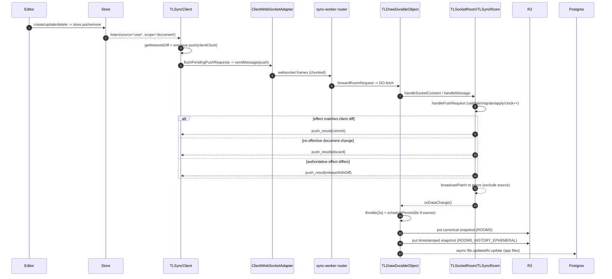

# Investigation: tldraw sync backend persistence (v3.15.x, commit 1e9ed3513)

## Summary
On branch `v3.15.x`, canvas edits are written into the local `Store`, observed by `TLSyncClient`, sent as network diffs over websocket to the sync worker Durable Object, authoritatively applied in `TLSyncRoom`, then persisted by `TLDrawDurableObject` to R2 (latest + history) with app-file `updatedAt` metadata updated in Postgres.

## Symptoms
- Need a precise end-to-end path from canvas mutation to backend persistence.
- Need exact persistence write points and ack/rebroadcast behavior.

## Investigation Log

### Phase 1 - Initial assessment
**Hypothesis:** Client mutations become store diffs and flow through sync-core to worker persistence.
**Findings:** Confirmed this overall architecture from sync/editor/worker wiring.
**Evidence:**
- `apps/dotcom/client/src/tla/components/TlaEditor/TlaEditor.tsx:199-212`
- `packages/sync/src/useSync.ts:113-146`
**Conclusion:** Confirmed.

### Phase 2 - Systematic exploration via context builder
**Hypothesis:** The authoritative mutation logic and persistence boundaries are in `TLSyncRoom` and `TLDrawDurableObject`.
**Findings:** Context builder selected core client, protocol, room, and worker persistence files; identified stable anchors (`handlePushRequest`, `persistToDatabase`, etc.).
**Evidence:** Oracle plan chat `sync-persistence-trace-75AFF8`.
**Conclusion:** Confirmed; continued with targeted file-level evidence.

### Phase 3 - Local mutation and outbound sync path
**Hypothesis:** Shape create/update/delete routes through `store.put/remove`, then `Store.listen(source:'user', scope:'document')` triggers `TLSyncClient.push`.
**Findings:**
- Editor mutators write to store (`store.put`, `store.remove`).
- `TLSyncClient` subscribes to user/document changes and calls `push(changes)`.
- `push` converts `RecordsDiff` to network diff, queues push requests, then flushes sends.
**Evidence:**
- `packages/editor/src/lib/editor/Editor.ts:8362-8398` (`_updateShapes` -> `this.store.put(updates)`)
- `packages/editor/src/lib/editor/Editor.ts:8417-8445` (`deleteShapes` path; remove call follows in function)
- `packages/store/src/lib/Store.ts:249-289` (`_flushHistory`)
- `packages/store/src/lib/Store.ts:314-322` (`updateHistory` source user/remote)
- `packages/store/src/lib/Store.ts:633-676` (`listen`, `mergeRemoteChanges`)
- `packages/sync-core/src/lib/TLSyncClient.ts:201-211` (store listener)
- `packages/sync-core/src/lib/TLSyncClient.ts:501-536` (`push` + queue)
- `packages/sync-core/src/lib/TLSyncClient.ts:539-575` (`flushPendingPushRequests`)
**Conclusion:** Confirmed.

### Phase 4 - Transport and server ingress
**Hypothesis:** Pushes are chunked over websocket, forwarded to room DO, then assembled and routed to authoritative room handler.
**Findings:**
- Client `sendMessage` chunks JSON with `chunk(...)`.
- Worker websocket route forwards `/app/file/:roomId` to `TLDR_DOC` DO.
- Server socket layer reassembles chunks using `JsonChunkAssembler` then calls `room.handleMessage`.
**Evidence:**
- `packages/sync-core/src/lib/ClientWebSocketAdapter.ts:198-207`
- `packages/sync-core/src/lib/chunk.ts:12-30`, `:42-79`
- `apps/dotcom/sync-worker/src/worker.ts:107-114`
- `apps/dotcom/sync-worker/src/routes/tla/forwardRoomRequest.ts:8-17`
- `packages/sync-core/src/lib/TLSocketRoom.ts:172-213`
**Conclusion:** Confirmed.

### Phase 5 - Authoritative apply, ack, and rebroadcast
**Hypothesis:** Server applies document diffs in `handlePushRequest`, then returns `commit|discard|rebaseWithDiff` and broadcasts patches to other sessions.
**Findings:**
- `TLSyncRoom.handlePushRequest` applies operations transactionally, with migration/validation checks.
- Source client gets `push_result` action:
  - `commit` when server effect matches client diff,
  - `discard` when no effective doc change,
  - `rebaseWithDiff` when server-authoritative diff differs.
- Merged diffs are rebroadcast to peers (`broadcastPatch`) excluding source session.
- `onDataChange` only fires when document clock changed.
**Evidence:**
- `packages/sync-core/src/lib/TLSyncRoom.ts:889-1178`
- `packages/sync-core/src/lib/TLSyncRoom.ts:1119-1168`
- `packages/sync-core/src/lib/TLSyncRoom.ts:1174-1178` (`onDataChange?.()`)
**Conclusion:** Confirmed.

### Phase 6 - Durable persistence writes
**Hypothesis:** Room changes schedule deferred persistence; writes go to R2 with app metadata update in Postgres.
**Findings:**
- Room is configured with `onDataChange` -> `triggerPersistSchedule` (throttled 2s).
- Scheduler sets alarm with `PERSIST_INTERVAL_MS = 8000` (`if-sooner`).
- `persistToDatabase` uses execution queue + document-clock dedupe.
- Writes snapshot to:
  1) `ROOMS` bucket (canonical snapshot)
  2) `ROOMS_HISTORY_EPHEMERAL` bucket (timestamped version)
- For app files, asynchronously updates `file.updatedAt` in Postgres.
- Last session leaving forces a persist before room close.
**Evidence:**
- `apps/dotcom/sync-worker/src/TLDrawDurableObject.ts:134-136`, `:486-488`, `:689-726`, `:734-737`
- `apps/dotcom/sync-worker/src/TLDrawDurableObject.ts:124-132` (persist on last-out)
- `apps/dotcom/sync-worker/src/config.ts:5`
- `apps/dotcom/sync-worker/src/r2.ts:1-3`
- `apps/dotcom/sync-worker/src/AlarmScheduler.ts:27-77`
**Conclusion:** Confirmed.

### Phase 7 - Git history sanity check
**Hypothesis:** Recent branch changes may have altered this pipeline.
**Findings:** Recent visible commits on these files in `v3.15.x` were mostly release/license churn; no obvious recent architectural rewrite in sampled history.
**Evidence:** `git log` (8 commits sampled for sync files).
**Conclusion:** No immediate contradiction to identified flow.

## Root Cause (for “how persistence works”)
Persistence is intentionally split into:
1. **Client speculative sync** (`TLSyncClient`) from user-scoped store diffs.
2. **Server-authoritative merge** (`TLSyncRoom`) with migration/validation and clocked conflict handling.
3. **Deferred durable writes** (`TLDrawDurableObject`) via throttle + alarm, writing snapshots to R2 and metadata to Postgres.

So the write path is not “every mutation directly writes DB”; it is **authoritative in-memory room state first**, then **batched/deferred persistence**.

## Eliminated Hypotheses
- **“Replicator is the main live canvas persistence path.”** Eliminated for this flow; live room canvas persistence here is via `TLSyncRoom` + `TLDrawDurableObject` R2 pipeline.
- **“Client receives same patches it just sent.”** Eliminated; source receives `push_result`, peers receive `patch` rebroadcast.

## Recommendations
1. Keep using function anchors (`handlePushRequest`, `persistToDatabase`) for future tracing rather than hardcoding line numbers.
2. If durability lag matters, evaluate `PERSIST_INTERVAL_MS` and throttle values against product consistency expectations.
3. Add explicit telemetry for `push_result` action mix (`commit/discard/rebase`) to monitor conflict pressure.

## Preventive Measures
- Add/maintain architecture docs near sync-worker describing in-memory authoritative state vs deferred persistence.
- Keep tests around reconnect + rebase + persistence dedupe (`_lastPersistedClock`) behavior.
- Document SLOs around expected persistence delay windows (2s throttle + up to 8s alarm cadence).

## Mermaid diagram (code paths)

